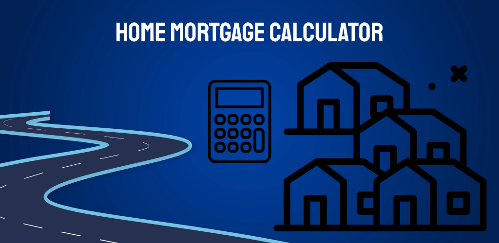
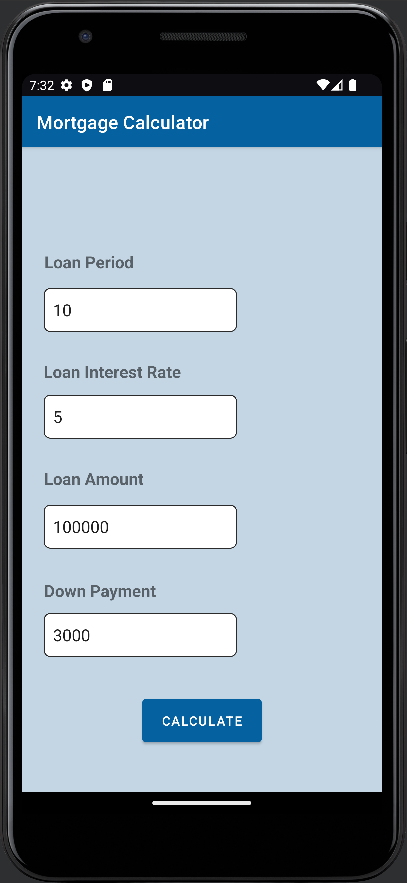
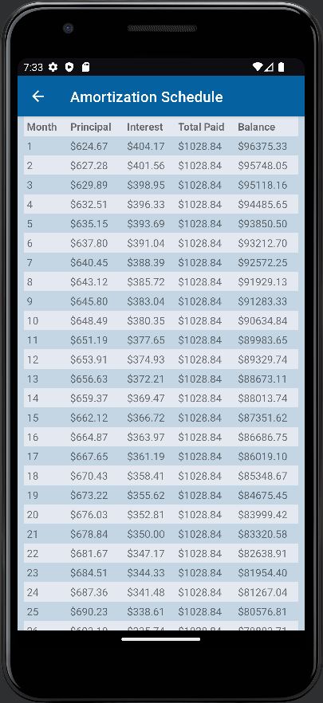

# Home Mortgage Calculator Android App

## Developers: Inti Espejo & James Jang (JinTech Studios)

This app was developed using Java and Kotlin. Using this app, the user can enter their loan amount, period, interest rate, and down payment in order to calculate their amortization schedule.

## User Loan Information Input Screen

As shown above, upon opening our app, the user will be prompted to enter specific information regarding their loan including the loan period, interest rate, loan amount, as well as their initial down payment.

Once the user taps the **_Calculate_** button, they will be sent to the next screen that displays their calculated amortization schedule based on the numbers that they inputted on the first screen.

## Calculated Amortization Schedule Screen

## Download Link:
https://play.google.com/store/apps/details?id=com.jintech.homemortgage&pli=1
